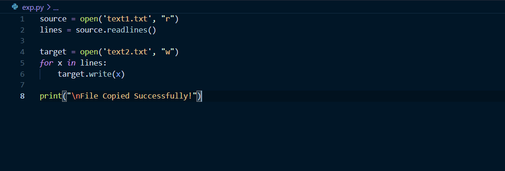
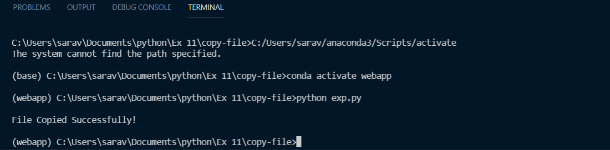

# copy-file
## AIM:
To write a python program for copying the contents from one file to another file.
## EQUIPEMENT'S REQUIRED: 
PC
Anaconda - Python 3.7
## ALGORITHM: 
### Step 1:
To start with create two text files. A file which is the source [text1.txt] to be copied to the target file [text2.txt].
### Step 2: 
Using write() function to copy the content from text1.txt to the target file, text2.txt.
### Step 3: 
Save and run the python program in the terminal.
### Step 4:  
The content from the source file has been copied to the target file.
### Step 5: 
Hence, the result is obtained.

## PROGRAM:
```
''' Developed by: Saravana Kumar.S
    RegisterNumber: 21005866 '''

source = open('text1.txt', "r")
lines = source.readlines()

target = open('text2.txt', "w")
for x in lines:
    target.write(x)

print("\nFile Copied Successfully!")
```
## OUTPUT:
### PROGRAM FILE:

### SOURCE FILE:

### TERMINAL:

### TARGET FILE (After copying):

## RESULT:
Thus the program is written to copy the contents from one file to another file.